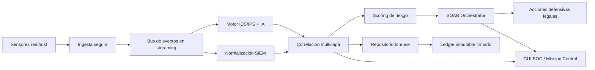

# DECKTROY / SENTINEL X — Blueprint Estratégico de Ciberdefensa

> Alcance: **exclusivamente defensivo y legal**. Este diseño prohíbe explícitamente acciones ofensivas, represalias y explotación de terceros.

## 1) Resumen Ejecutivo

DECKTROY se define como una plataforma integral de ciberdefensa para infraestructura crítica con enfoque:

- Zero Trust + Defensa en profundidad.
- Detección y respuesta en tiempo real (SOC operativo).
- Trazabilidad forense y auditoría inmutable.
- Automatización defensiva legal (SOAR).
- Despliegue Linux multi-distro y operación en on-prem, híbrido y cloud.

---

## 2) Arquitectura Técnica Completa

### 2.1 Capas del sistema

1. **Plano de Datos (Data Plane)**
   - Sensores de red/host.
   - Captura de tráfico, logs, procesos, autenticación.
   - Ingesta streaming de eventos.

2. **Plano de Control (Control Plane)**
   - Motor de políticas centralizado.
   - Orquestación de respuestas.
   - Gestión de identidades, roles y aprobaciones.

3. **Plano de Inteligencia (Intelligence Plane)**
   - IDS/IPS híbrido: firmas + heurística + comportamiento + ML.
   - Scoring dinámico de riesgo por entidad (host, usuario, servicio, flujo).

4. **Plano Forense y Cumplimiento**
   - Repositorio forense (eventos + cadena hash).
   - Evidencia firmada.
   - Auditoría inviolable y reportes regulatorios.

### 2.2 Microservicios propuestos

- `sensor-network-service`
- `sensor-host-edr-service`
- `ingestion-gateway-service`
- `stream-bus-service` (Kafka/NATS/Pulsar)
- `detection-engine-service`
- `threat-intel-service`
- `policy-decision-point (PDP)`
- `policy-enforcement-point (PEP)`
- `soar-orchestrator-service`
- `forensics-repository-service`
- `audit-ledger-service`
- `api-gateway-service` (REST + gRPC)
- `soc-ui-service` (nativo desktop + API)

### 2.3 Seguridad de comunicaciones

- mTLS interno entre servicios.
- Rotación de certificados.
- Cifrado en tránsito (TLS1.3) y reposo (AES-256).
- Segregación por namespaces/redes internas.

### 2.4 Alta disponibilidad

- Servicios stateless escalables horizontalmente.
- Clúster activo-activo para componentes críticos.
- Reintentos idempotentes y colas de compensación.
- Circuit breakers y backpressure.

---

## 3) Diagrama de Flujo de Datos (Conceptual)

---

## 4) Especificación Funcional Detallada

### 4.1 Defensa Perimetral

- NGFW lógico con políticas por app/contexto.
- Detección de anomalía volumétrica (anti-DDoS defensivo).
- Integración WAF y georestricción dinámica por política.
- Modelo default-deny (listas blancas por servicio).

### 4.2 IDS/IPS híbrido

- Firmas IoC/IoA.
- Heurística de comportamiento por baseline.
- Detección de beaconing y exfiltración.
- Detección de privilegio inusual, lateralidad y persistencia.

### 4.3 IA de anomalías

- Modelos supervisados / no supervisados.
- Perfiles por host/usuario/servicio.
- Umbrales adaptativos por contexto horario y criticidad.

### 4.4 EDR avanzado (defensivo)

- Monitoreo de procesos.
- Integridad de binarios y archivos críticos.
- Telemetría de ejecución y cambios de memoria observables.
- Sandboxing de artefactos sospechosos (entorno aislado).

### 4.5 SIEM + SOAR

- Centralización y normalización de logs.
- Correlación temporal y causal.
- Motor de reglas y playbooks.
- Ejecución automática con aprobaciones por criticidad.

### 4.6 Contramedidas defensivas automatizadas (permitidas)

- Cuarentena lógica de host.
- Bloqueo dinámico IP/segmento.
- Revocación credencial/sesiones.
- Forzado MFA.
- Limitación de ancho de banda.
- Hardening y parcheo crítico controlado.

### 4.7 Prohibiciones explícitas

- Ataques de represalia.
- Explotación de sistemas externos.
- Acciones ofensivas ilegales.

---

## 5) Modelo de Datos Híbrido

### 5.1 SQL relacional (operacional y forense)

Tablas núcleo:

- `events`
- `alerts`
- `hosts`
- `users`
- `processes`
- `network_flows`
- `authentication_attempts`
- `anomalies`
- `threat_intelligence`
- `audit_logs`

Tablas de respuesta:

- `defensive_actions`
  - `action_id`, `nombre`, `categoria`, `criticidad`, `tipo`, `descripcion`, `condiciones`, `parametros`, `impacto_estimado`, `tiempo_estimado`, `requiere_aprobacion`
- `defensive_playbooks`
  - `playbook_id`, `nombre`, `tipo_amenaza`, `secuencia_acciones`, `prioridad`, `modo_ejecucion`, `rollback_disponible`, `registro_ejecuciones`
- `response_history`
  - `incidente_id`, `acciones_ejecutadas`, `operador`, `resultado`, `metricas_efectividad`

### 5.2 NoSQL / TSDB

- Métricas de alto volumen y series de tiempo.
- Telemetría de red por ventana temporal.
- Features de IA para entrenamiento online.

### 5.3 Ledger inmutable

- Hash encadenado por evento crítico.
- Firma de bloque interno.
- Sellado temporal para evidencia jurídica.

---

## 6) Diseño UI/UX (Wireframes conceptuales)

### 6.1 Dashboard principal

- **Header**: estado de plataforma, rol, entorno, latencia.
- **KPIs**: amenaza global, incidentes activos, hosts en cuarentena, servicios públicos expuestos, respuestas automáticas.
- **Centro**: tabla de eventos + inspector técnico + mission control.
- **Panel lateral**: globo de actividad, servicios expuestos, conexiones activas, acciones rápidas.

### 6.2 Vista de red (grafo)

- Nodos por host/segmento.
- Aristas por flujo.
- Color por riesgo y animación por intensidad.

### 6.3 Timeline forense

- Cursor temporal.
- Filtros por severidad/entidad.
- Reconstrucción de cadena de ataque.

### 6.4 Centro de alertas

- Agrupación automática de alertas relacionadas.
- Prioridad por impacto + probabilidad.
- Acciones one-click (solo defensivas).

---

## 7) Flujos de Respuesta Automatizada (SOAR)

### Flujo A: Exposición crítica no autorizada
1. Detección de puerto público inesperado.
2. Correlación con inventario permitido.
3. Si no autorizado: aplicar política de contención.
4. Crear incidente + registrar evidencia + notificar operador.
5. Revalidar estado post-mitigación.

### Flujo B: Intento de fuerza bruta
1. Múltiples fallos de autenticación.
2. Score de riesgo supera umbral.
3. Bloqueo temporal de origen + forzado MFA.
4. Apertura de caso forense.

### Flujo C: Beaconing sostenido
1. Detectar periodicidad sospechosa.
2. Verificar reputación destino.
3. Segmentar host + monitoreo intensivo.
4. Checklist de erradicación y cierre controlado.

---

## 8) Especificación para Equipo de Desarrollo

### 8.1 Estándares
- Python 3.12+, tipado estático progresivo.
- Contratos API OpenAPI + protobuf.
- Observabilidad: métricas, tracing, logs estructurados.

### 8.2 Roadmap por fases

**Fase 1 (actual hardening):**
- Installer único multi-distro.
- GUI SOC en vivo (servicios, conexiones, exposición, mission-control).
- Base forense local y exportes.

**Fase 2 (escalado):**
- Event bus real.
- API gateway seguro.
- Correlación multicapa distribuida.

**Fase 3 (infra crítica):**
- Control plane HA.
- Ledger firmado distribuido.
- Integración híbrida cloud/on-prem.

### 8.3 Pruebas
- Unit tests por parser y scoring.
- Integración con datos sintéticos.
- Chaos/resilience tests para failover.
- Simulación de incidentes en laboratorio.

---

## 9) Documento Técnico para Inversionistas (resumen)

### 9.1 Propuesta de valor
- Plataforma defensiva integral para activos críticos.
- Tiempo de respuesta reducido por automatización legal.
- Trazabilidad forense apta para auditorías regulatorias.

### 9.2 Mercado objetivo
- Operadores de infraestructura crítica.
- SOC empresariales y MSSP.
- Sectores regulados (finanzas, energía, salud, telecom).

### 9.3 Diferenciadores
- Zero Trust operativo + SOAR defensivo legal.
- Mission-control en tiempo real.
- Diseño portable Linux y despliegue híbrido.

### 9.4 KPI de negocio
- MTTD / MTTR.
- % incidentes contenidos automáticamente.
- reducción de exposición pública no autorizada.
- cumplimiento (auditorías aprobadas).

---

## 10) Compatibilidad Linux y Operación

- Instalación y arranque con un solo archivo:
  - `./install_decktroy_linux.sh`
- Soporte de instalación base para: apt, dnf, yum, pacman, zypper.
- Lanzadores posteriores: `Decktroy`, `decktroy`, `sentinel-x`.

